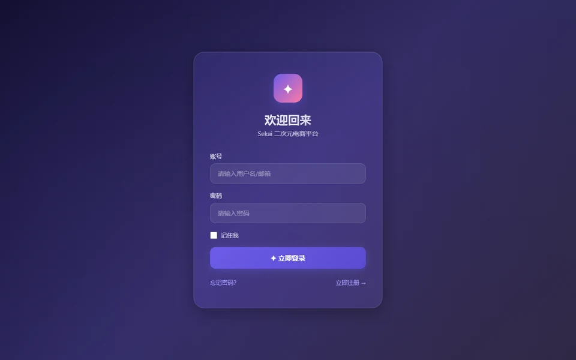

# 馃洅 Sekai eBusiness 路 鐢靛晢缁冧範椤圭洰

> **Spring Boot + MyBatis 鍒嗗眰鐢靛晢鍚庣**
> A clean, layered e-commerce backend built with Spring Boot + MyBatis

[](https://www.oracle.com/java/)
[](https://spring.io/projects/spring-boot)
[](https://mybatis.org/)
[](https://maven.apache.org/)
[](LICENSE)

鍩轰簬 **Spring Boot + MyBatis** 鐨勭數鍟嗕笟鍔＄粌涔犻」鐩紝閲囩敤 `com.youkeda.application.ebusiness` 鍖呯粨鏋勶紝鍒嗗眰娓呮櫚锛岄€傚悎浣滀负鐢靛晢鍚庣鍏ラ棬涓庤繘闃跺弬鑰冦€?
An e-commerce practice project with **clear layered architecture** 鈥?a great reference for learning backend development.

## 馃搻 Layered Architecture / 鍒嗗眰鏋舵瀯

```text
control 鈹€鈹€鈫?service 鈹€鈹€鈫?dao 鈹€鈹€鈫?MySQL
    鈫?          鈫?    鈹斺攢鈹€ model 鈹€鈹€鈹€鈹?(DTO)
```

- `control/`锛氭帴鍙ｅ叆鍙?API controllers
- `service/`锛氫笟鍔￠€昏緫 Business logic
- `dao/`锛氭暟鎹闂眰 Data access
- `dataobject/`锛氭暟鎹簱瀹炰綋 DB entities
- `model/`锛氬墠鍚庣浼犺緭瀵硅薄 DTOs
- `data-build/`锛氭暟鎹簱鍒濆鍖栬剼鏈?DB init scripts

## 馃洜锔?Tech Stack / 鎶€鏈爤

- Java 17 + Spring Boot 3.x
- MyBatis
- Maven锛堝惈 `mvnw` 鍖呰鍣級

## 鈻讹笍 Quick Start / 蹇€熷紑濮?
```powershell
# 1. 鍒濆鍖栨暟鎹簱锛堣剼鏈湪 data-build/锛?# 2. 閰嶇疆 src/main/resources/application.properties 涓殑鏁版嵁搴撹处鍙?mvn spring-boot:run
```

鏁版嵁搴撳瘑鐮侀€氳繃鐜鍙橀噺娉ㄥ叆锛坄DB_PASSWORD`锛夛紝閬垮厤纭紪鐮併€?
## 馃摑 Notes / 璇存槑

鏈」鐩负瀛︿範/缁冧範鎬ц川椤圭洰锛岄€傚悎浣滀负鐢靛晢鍚庣鍏ラ棬鍙傝€冦€?
## 馃搫 License

[MIT](LICENSE) 漏 2026 [sekai-lyr](https://github.com/sekai-lyr)


<p align="center">
  
</p>
---

**猸?If this project helped you, star it! 濡傛灉杩欎釜椤圭洰瀵逛綘鏈夊府鍔╋紝娆㈣繋 Star锛?*
